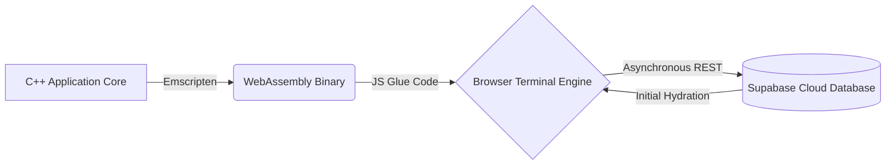

<div align="center">
  
  <h1>Library Management System</h1>
  <p>
    <b>A High-Performance, Serverless Library Management Solution Engineered in C++ via WebAssembly.</b>
  </p>

  [](https://isocpp.org/)
  [](https://webassembly.org/)
  [](https://supabase.com/)
  [](#)
</div>

---

## 📌 Executive Summary

This project reimagines standard console-based applications by bridging the gap between low-level performance and modern web accessibility. The **Library Management System** is a robust, strictly Object-Oriented C++ application compiled directly into WebAssembly (WASM). 

Operating entirely on the client-side without relying on traditional backend server instances, it provides native C++ execution speeds within a browser environment while maintaining real-time data persistence through a cloud-based **Supabase** synchronization bridge.

## 🚀 Technical Highlights

- **Object-Oriented Architecture**: Strict adherence to OOP paradigms, utilizing robust class hierarchies for state, memory, and entity management.
- **WASM Translation**: Leverages Emscripten to translate high-performance C++ code into binary instructional formats deployable universally across browsers.
- **Distributed State Synchronization**: Real-time asynchronous data injection seamlessly syncing the volatile WebAssembly virtual file system with a persistent Supabase PostgreSQL database.
- **Custom DOM I/O Bridge**: Features an intercepted standard input/output stream (`iostream`) layer, transforming local CLI commands into an aesthetically tailored graphical terminal.

## 🏗️ System Architecture



## ⚙️ Core Functionality

- **Inventory Management**: Instantiate and serialize dynamic `Book` objects via structural memory allocation.
- **Circulation Control**: Atomic issue and return subroutines integrated with precise cloud-status flagging.
- **Data Indexing**: High-efficiency retrieval queries for physical inventory audits spanning precise titles and numerical identification.

## 💻 Local Deployment Process

To run WebAssembly binaries locally, standard HTTP cross-origin security protocols mandate a localized development server. 

```bash
# 1. Clone the repository
git clone https://github.com/vivan1410/Library-management-25BCE5637.git

# 2. Navigate to the deployment directory
cd Library-management-25BCE5637

# 3. Mount the WebAssembly network server
python -m http.server 8000
```
*Navigate to `http://localhost:8000/` in a modern browser to initialize the WASM runtime environment.*
